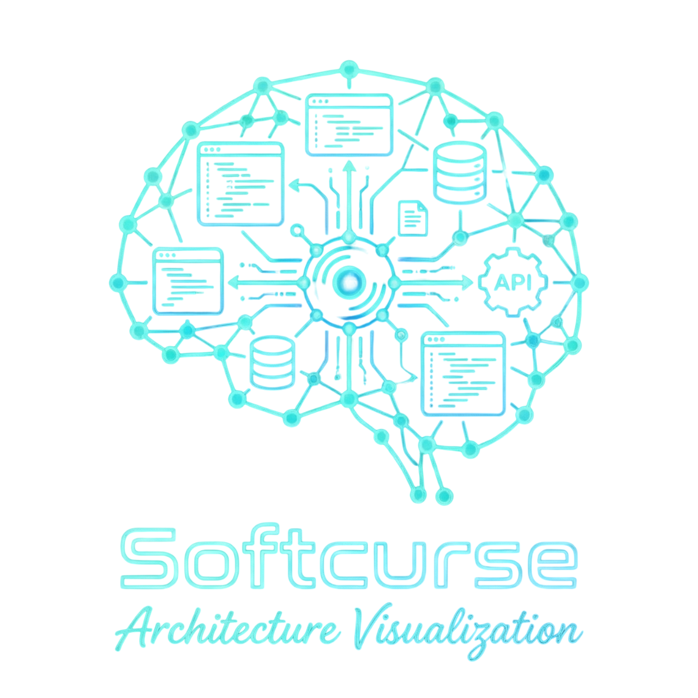

<p align="center">
  
</p>

<h1 align="center">Softcurse Architecture Visualizer</h1>

<p align="center">
  <strong>Professional-grade code intelligence platform for deep architectural analysis</strong><br/>
  <em>13+ languages · WebGL graph rendering · AI-powered insights · zero-server architecture</em>
</p>

<p align="center">
  
  
  
  
  
  <br/>
  <a href="https://softcurse-website.pages.dev/"></a>
  <a href="https://github.com/Beardicuss/Softcurse-Architecture-Visualizer"></a>
</p>

---

## Overview

Softcurse Architecture Visualizer is a desktop application that parses, indexes, and visualizes codebases as interactive knowledge graphs. It combines a native WPF shell with an embedded React + TypeScript web application to deliver GPU-accelerated graph rendering, AI-powered code exploration, and deep dependency analysis — all running locally with no external servers required.

The application ingests source code through **Tree-sitter WASM parsers**, builds a queryable **LadybugDB graph database**, and renders the results in a **Sigma.js WebGL** canvas. An integrated **LangChain AI agent** supports natural language queries over the knowledge graph using Graph RAG.

---

## Core Capabilities

### 🔍 Multi-Language Code Parsing
Tree-sitter WASM provides deep AST-level analysis for **13 programming languages**:

| Language | Language | Language |
|:--------:|:--------:|:--------:|
| C | C++ | C# |
| Go | Java | JavaScript |
| PHP | Python | Ruby |
| Rust | Swift | TypeScript |
| TSX | | |

Each parser extracts **classes, functions, methods, interfaces, imports, call chains**, and **inheritance hierarchies** from source code — not just file-level dependencies.

### 📊 WebGL Graph Visualization
- **Sigma.js** with **graphology** for rendering graphs with 10,000+ nodes at 60fps
- **ForceAtlas2** layout algorithm for organic, force-directed node positioning
- **Leiden community detection** to auto-cluster related symbols into functional groups
- Interactive pan, zoom, drag, and node selection with real-time highlighting

### 🤖 AI-Powered Code Intelligence
An integrated LangChain agent leverages **Graph RAG** (Retrieval-Augmented Generation) to answer questions about your architecture:
- Uses the knowledge graph as a structured retrieval backend
- Supports natural language queries: *"What depends on UserService?"*, *"Trace the login flow"*
- Tools for impact analysis, code lookup, vector search, and Cypher queries
- Multi-provider support — switch between AI backends without code changes

### 🔎 Hybrid Search Engine
- **BM25 text search** via MiniSearch for fast keyword matching
- **Vector similarity search** via HuggingFace embeddings (WebGPU/WASM)
- Combined **hybrid ranking** for semantic code discovery

### 📈 Impact Analysis & Flow Tracing
- Click any symbol to see its **360° context** — upstream callers, downstream dependencies
- **Process flow tracing** visualizes execution paths from entry points through call chains
- **Confidence scoring** on each inferred relationship
- **Mermaid diagram** rendering for visual flow documentation

### 🔐 Privacy-First Architecture
- **Zero-server** — all indexing happens in-browser via WASM
- API keys stored in browser localStorage — never transmitted except to the selected LLM provider
- No telemetry, no cloud dependencies, no data leaves your machine

---

## Supported AI Providers

| Provider | Model Examples | Pricing |
|---|---|---|
| **Google Gemini** | `gemini-2.0-flash`, `gemini-1.5-pro` | Free tier available |
| **Ollama** | `llama3.2`, `deepseek-coder`, `mistral` | Free (runs locally) |
| **OpenAI** | `gpt-4o`, `gpt-4o-mini` | Paid API |
| **Anthropic** | `claude-sonnet-4-20250514`, `claude-3-5-haiku` | Paid API |
| **OpenRouter** | 100+ models from multiple providers | Pay-per-token |
| **MiniMax** | `MiniMax-M2.5` | Paid API |

Configure in the app via **⚙️ Settings** → select provider → paste API key → save.

---

## Quick Start

### Installation
1. Download the latest installer from the [Releases](https://github.com/Beardicuss/Softcurse-Architecture-Visualizer/releases) page.
2. Run `SoftcurseArchitectureVisualizerSetup_v2.0.0.exe`.
3. Launch from the Start Menu or Desktop shortcut.

### First Use
1. **Load a project** — Drag & drop a `.zip` of your codebase, or paste a GitHub repository URL.
2. **Wait for indexing** — The progress overlay shows parsing, graph construction, and community detection phases.
3. **Explore** — Pan, zoom, and click nodes in the interactive graph. Use the file tree panel on the left.
4. **Configure AI** — Click ⚙️ in the title bar, select Google Gemini (recommended), paste your API key.
5. **Ask questions** — Open the AI chat tab in the right panel and ask about your architecture.

---

## Development

### Prerequisites
| Tool | Version |
|---|---|
| .NET SDK | 8.0+ |
| Node.js | 18+ |
| npm | 9+ |

### Build from Source

```powershell
# 1. Clone the repository
git clone https://github.com/Beardicuss/Softcurse-Architecture-Visualizer.git
cd Softcurse-Architecture-Visualizer

# 2. Build the web application
cd ArchitectureVisualizerApp/Assets/WebApp
npm install
npm run build

# 3. Build the desktop application
cd ../../
dotnet build

# 4. Run
dotnet run
```

### Publish Self-Contained Installer

```powershell
# Publish .NET (self-contained, single file)
cd ArchitectureVisualizerApp
dotnet publish -c Release -r win-x64 --self-contained true /p:PublishSingleFile=true -o publish

# Compile with Inno Setup
iscc analyzer.iss
# Installer output: output/SoftcurseArchitectureVisualizerSetup_v2.0.0.exe
```

---

## Architecture

```
ArchitectureVisualizerApp/
├── MainWindow.xaml            # WPF shell — title bar + WebView2
├── MainWindow.xaml.cs         # WebView2 initialization + virtual host mapping
├── SettingsWindow.xaml         # Application settings dialog
├── Assets/
│   ├── ui/                    # Application icon (arch.ico, arch.png)
│   └── WebApp/                # Embedded React application
│       ├── src/
│       │   ├── components/    # 17 React components
│       │   ├── core/          # Engine modules
│       │   │   ├── tree-sitter/  # WASM AST parser
│       │   │   ├── ingestion/    # Multi-phase indexing pipeline (12 modules)
│       │   │   ├── graph/        # Knowledge graph construction
│       │   │   ├── lbug/         # LadybugDB WASM adapter
│       │   │   ├── search/       # Hybrid search (BM25 + vector)
│       │   │   ├── embeddings/   # HuggingFace embeddings pipeline
│       │   │   └── llm/          # LangChain AI agent (6 modules)
│       │   ├── hooks/         # React state management
│       │   ├── services/      # ZIP extraction, Git clone, server connection
│       │   ├── vendor/leiden/  # Community detection algorithm
│       │   └── workers/       # Web Worker for background indexing
│       └── public/wasm/       # Tree-sitter WASM binaries (13 languages)
└── analyzer.iss               # Inno Setup installer script
```

---

## Tech Stack

| Layer | Technology | Purpose |
|---|---|---|
| **Desktop Shell** | WPF + WebView2 | Native Windows frame with embedded browser |
| **Web Framework** | Vite + React 18 + TypeScript | Component-based UI |
| **Graph Rendering** | Sigma.js + graphology + ForceAtlas2 | GPU-accelerated WebGL visualization |
| **Code Parsing** | Tree-sitter WASM | AST extraction for 13 languages |
| **Graph Database** | LadybugDB WASM | In-browser Cypher-queryable graph store |
| **AI Agent** | LangChain + Graph RAG | Multi-provider LLM integration |
| **Community Detection** | Leiden Algorithm | Auto-clustering of related symbols |
| **Search** | MiniSearch + HuggingFace | Hybrid BM25 + vector similarity |
| **Styling** | Tailwind CSS v4 | Utility-first CSS with custom Cyberpunk theme |
| **Diagrams** | Mermaid | Flow chart and architecture diagram rendering |
| **Installer** | Inno Setup | Professional Windows installer |

---

## License

**Softcurse Proprietary** — All Rights Reserved.

Developed by **Dante Berezinsky** · [Softcurse LAB.](https://softcurse-website.pages.dev/)
